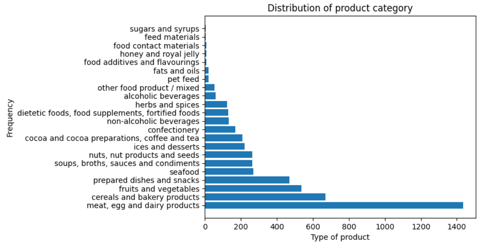
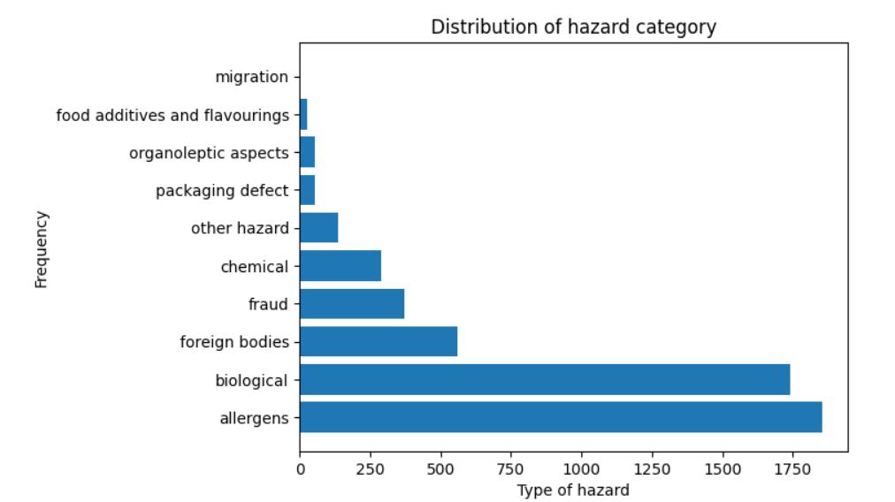

# Food Hazard Detector
RAG application that answers user questions about potential hazard found in food products, i.e. undeclared allergens, contamination, found chemicals or foreign bodies.


## Dataset
The data was taken from [SemEval 2025 Task 9: The Food Hazard Detection Challenge](https://food-hazard-detection-semeval-2025.github.io/) and contains of 5082 food-incident reports collected from the web. 

The data fields used in analysis, indexing, ground truth generation:

- title
- hazard-category
- product-category
- hazard
- product

The full text of the recall in the column "text" was not used, but may be used in the future analysis and experiments.

The class distribution is heavily imbalanced. The data includes 1,256 different products (e.g., "ice cream," "chicken based products," "cakes") sorted into 22 categories (e.g., "meat, egg and dairy products," "cereals and bakery products," "fruits and vegetables"). The 261 possible "hazard"-values (e.g., "salmonella," "listeria monocytogenes," "milk and products thereof") are sorted into 10 "hazard-category" values.

Details are in `notebooks/analyze-dataset.ipynb` 

<p align="center">
  
</p>


<p align="center">
  
</p>

The data could be found in `data/incidents_train.csv`

## Technologies

- Python 3.12
- Docker and Docker Compose for containerization
- [Minsearch](https://github.com/alexeygrigorev/minsearch) for full-text search
- Flask as the API interface (see [Background](#background) for more information on Flask)
- PostgreSQL as the backend for it
- OpenAI, Ollama (llama3.1) as an LLM

## Preparation

To run llama3.1 on Ollama you need to:

- install Ollama
```
curl -fsSL https://ollama.com/install.sh | sh
```

and run 
```
ollama serve
```

- pull llama3.1 model
```
ollama pull llama3.1
```

- run it
```
ollama run llama3.1
```

You could check the instructions on the official webpage https://ollama.com/

#### Docker

```
docker run -it \
    -v ollama:/root/.ollama \
    -p 11434:11434 \
    --name ollama \
    ollama/ollama
```

Pulling the model
```
docker exec -it ollama bash
ollama pull llama3.1
```

For dependency management, we use pipenv, so you need to install it:

```bash
pip install pipenv
```

Once installed, you can install the app dependencies:

```bash
pipenv install --dev
```

## Running the application


### Database configuration

Before the application starts for the first time, the database
needs to be initialized.

First, run `postgres`:

```bash
docker-compose up postgres
```

Then run the [`db_prep.py`](food_hazard_detector/db_prep.py) script:

```bash
pipenv shell

cd food_hazard_detector

export POSTGRES_HOST=localhost
python db_prep.py
```

To check the content of the database, use `pgcli` (already
installed with pipenv):

```bash
pipenv run pgcli -h localhost -U your_username -d food_hazard_detector -W
```

You can view the schema using the `\d` command:

```sql
\d conversations;
```

And select from this table:

```sql
select * from conversations;
```

### Running with Docker-Compose

The easiest way to run the application is with `docker-compose`:

```bash
docker-compose up
```

### Running locally

If you want to run the application locally,
start only postres:

```bash
docker-compose up postgres
```

If you previously started all applications with
`docker-compose up`, you need to stop the `app`:

```bash
docker-compose stop app
```

Now run the app on your host machine:

```bash
pipenv shell

cd food_hazard_detector

export POSTGRES_HOST=localhost
python app.py
```

### Running with Docker (without compose)

Sometimes you might want to run the application in
Docker without Docker Compose, e.g., for debugging purposes.

First, prepare the environment by running Docker Compose
as in the previous section.

Next, build the image:

```bash
docker build -t food-hazard-detector .
```

And run it:

```bash
docker run -it --rm \
    --network="food-hazard-detector_default" \
    --env-file=".env" \
    -e DATA_PATH="data/data.csv" \
    -p 5000:5000 \
    food-hazard-detector
```

## Using the application

When the application is running, we can start using it.

### Using `requests`

When the application is running, you can use
[requests](https://requests.readthedocs.io/en/latest/)
to send questions—use [test.py](test.py) for testing it:

```bash
pipenv run python test.py
```

It will pick a random question from a small list
and send it to the app.

### CURL

You can also use `curl` for interacting with the API:

```bash
URL=http://127.0.0.1:5000
QUESTION="Tell me the main biological hazard found in smoked sausage"
DATA='{
    "question": "'${QUESTION}'"
}'

curl -X POST \
    -H "Content-Type: application/json" \
    -d "${DATA}" \
    ${URL}/question
```

You will see something like the following in the response:

```json
{
  "answer": "Based on the context, the main biological hazard found in smoked sausage is Listeria monocytogenes. This is mentioned in three separate reports:\n\n* Recall of Smoked Pork Sausage Produced by Rimantas Meats, due to the Presence of Listeria monocytogenes\n* Mini Smoked Farmer Sausage recalled due to Listeria monocytogenes\n* o.t (smoked salmon) ltd is recalling various smoked salmon products due to the presence of listeria (note: while this report mentions salmon, it also specifically mentions that the product was a type of sausage)\n\nTherefore, the answer to your question is:\n\nListeria monocytogenes",
  "conversation_id": "b760c02d-2a85-4e20-8133-c53368292841",
  "question": "Tell me the main biological hazard found in smoked sausage"
}
```

## Code

The code for the application is in the [`food_hazard_detector`](food_hazard_detector/) folder:

- [`app.py`](food_hazard_detector/app.py) - the Flask API, the main entrypoint to the application
- [`rag.py`](food_hazard_detector/rag.py) - the main RAG logic for building the retrieving the data and building the prompt
- [`ingest.py`](food_hazard_detector/ingest.py) - loading the data into the knowledge base
- [`minsearch.py`](food_hazard_detector/minsearch.py) - an in-memory search engine
- [`db.py`](food_hazard_detector/db.py) - the logic for logging the requests and responses to postgres
- [`db_prep.py`](food_hazard_detector/db_prep.py) - the script for initializing the database

We also have some code in the project root directory:

- [`test.py`](test.py) - select a question for testing

### Interface

We use Flask for serving the application as an API.

Refer to the ["Using the Application" section](#using-the-application)
for examples on how to interact with the application.

### Ingestion

The ingestion script is in [`ingest.py`](food_hazard_detector/ingest.py).

Since we use an in-memory database, `minsearch`, as our
knowledge base, we run the ingestion script at the startup
of the application.

It's executed inside [`rag.py`](food_hazard_detector/rag.py)
when we import it.

## Experiments

For experiments, we use Jupyter notebooks.
They are in the [`notebooks`](notebooks/) folder.

To start Jupyter, run:

```bash
cd notebooks
pipenv run jupyter notebook
```

We have the following notebooks:

- [`rag-test.ipynb`](notebooks/rag-test.ipynb): The RAG flow and evaluating the system.
- [`evaluation-data-generation.ipynb`](notebooks/evaluation-data-generation.ipynb): Generating the ground truth dataset for retrieval evaluation.

### Retrieval evaluation

The basic approach - using `minsearch` without any boosting - gave the following metrics:

- Hit rate: 40%
- MRR: 26%

The improved version (with tuned boosting):

- Hit rate: 50%
- MRR: 37%

The best boosting parameters:

```python
boost = {
    'title': 2.35,
    'hazard_category': 1.12,
    'product_category': 0.08,
    'hazard': 0.20,
    'product': 1.62
}
```
Details are in `notebooks/retrieval-evaluation.ipynb`

### RAG flow evaluation

We used the LLM-as-a-Judge metric to evaluate the quality
of our RAG flow.

For `llama3.1`, in a sample with 288 records, we had:

- 114 (39.5%) `RELEVANT`
- 156 (54%) `PARTLY_RELEVANT`
- 18 (0.06%) `NON_RELEVANT`

Details are `in notebooks/rag-evaluation.ipynb`
